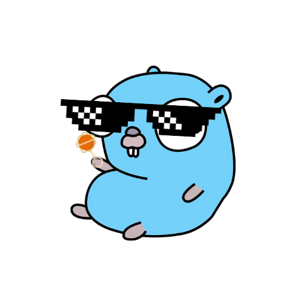

# GenZ

[](https://pkg.go.dev/github.com/Joffref/genz)
[](https://goreportcard.com/report/github.com/Joffref/genz)
[](LICENSE)


> At this moment, this project is in development. It is not ready for production use. See the [Contributing](#contributing) section if you would like to help make it better.

✨ Never write toil/boilerplate code again! ✨

Thanks to GenZ, you can generate code for your own needs, without having to write a single line of code.

<p align="center" heigth="50%">
     
</p>

GenZ is a template-based generator for Go. A single binary that can be called with the native `go generate` to automate generation of your Go code based on templates.

## Installation

You can install GenZ in different ways, depending on your needs.
We strongly recommend using the Go version for production use.

### Using Go - Production

```shell
go install github.com/Joffref/genz
```

### From source - Development

```shell
git clone https://github.com/Joffref/genz.git
cd genz
make install
```

## Getting Started

Let's say you have several types defined in your project (such as `Human` as defined below).
```go
package main

type Human struct {
	//+required
	Firstname string
	//+required
	Lastname string
	Age uint
}
```
And you want to add a `Validate()` method on these type.

With GenZ, all you have to do is to write a template once:
```mustache
package main

import (
    "fmt"
)

func (v {{ .Type.InternalName }}) Validate() error {
{{ range .Attributes }} {{ $attribute := . }}
{{ if eq .Type.InternalName "string" }}{{ range .Comments }}
{{ if eq . "+required" }}
    if v.{{ $attribute.Name }} == "" {
        return fmt.Errorf("attribute '{{ $attribute.Name }}' must be set")
    }
{{ end }}{{ end }}{{ end }}{{ end }}
    return nil
}
```
And generate the associated Go code tied to your type :

1. Add `//go:generate genz -type Human -template validator.tmpl -output human.gen.go` on your go code.
2. Call `go generate ./...`

And your validator is generated :sparkles:
```go
package main

import (
    "fmt"
)

func (v Human) Validate() error {
    if v.Firstname == "" {
        return fmt.Errorf("attribute 'Firstname' must be set")
    }
    if v.Lastname == "" {
        return fmt.Errorf("attribute 'Lastname' must be set")
    }
    return nil
}
```

Checkout other examples in [/examples](/examples) folder.

## Try it out
Explore built-in `examples`, clone repo, and run `go generate ./...` in the root

### CLI
```bash
Usage of genz:
        genz [flags] -type T -template foo.tmpl [directory]
        genz [flags] -type T -template foo.tmpl files... # Must be a single package
Flags:
  -output string
        output file name; default srcdir/<type>.gen.go
  -tags string
        comma-separated list of build tags to apply
  -template string
        go-template file name
  -type string
        comma-separated list of type names; must be set
```

## Contributing

If you would like to contribute to this project, please read the [CONTRIBUTING.md](CONTRIBUTING.md) file.

## License

This project is licensed under the Apache 2.0 - see the [LICENSE](LICENSE) file for details.

## Code of Conduct

This project is governed by the [Contributor Covenant Code of Conduct](CODE_OF_CONDUCT.md). By participating, you are expected to uphold this code.
